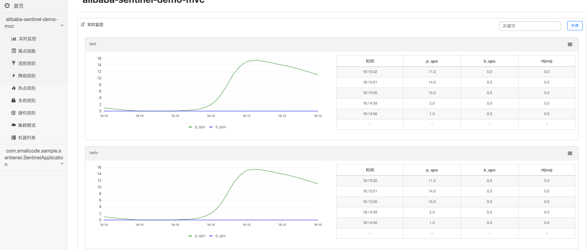

## Sentinel
分为两部分：
1. 客户端埋点 
2. Dashboard （收集，分析埋点数据）
文档建 https://github.com/alibaba/Sentinel/tree/master/sentinel-dashboard


## spring mvc demo
具体的maven文件和代码参考alibaba-sentinel-demo-mvc

客户端埋点
```java
 @SentinelResource(value = "test", blockHandler = "handleException", blockHandlerClass = {
      ExceptionUtil.class})
  @Override
  public void test() {
    System.out.println("Test");
  }
```
启动参数,指定Dashboard和项目的名字
```properties
-Dcsp.sentinel.dashboard.server=me.com:8080 -Dproject.name=alibaba-sentinel-demo-mvc
```


